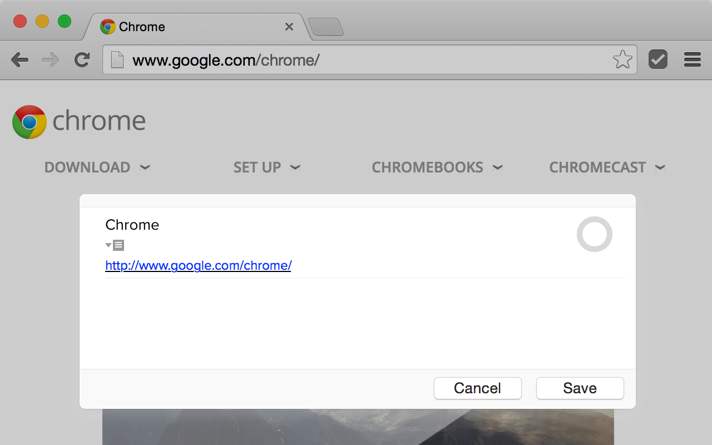
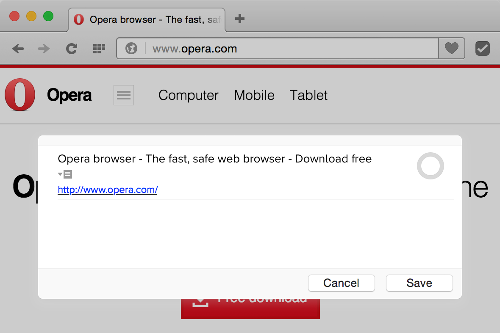

# Add to OmniFocus

Simple extension that adds currently opened page to [OmniFocus](http://www.omnigroup.com/omnifocus/) task manager for OS X. Page title goes to task title, URL goes to notes. Available for [Chrome](https://chrome.google.com/webstore/detail/add-to-omnifocus/hcooopccekebnaknpolhaoombcaakflp) and Opera (in moderation).

---
Licensed under MIT License
